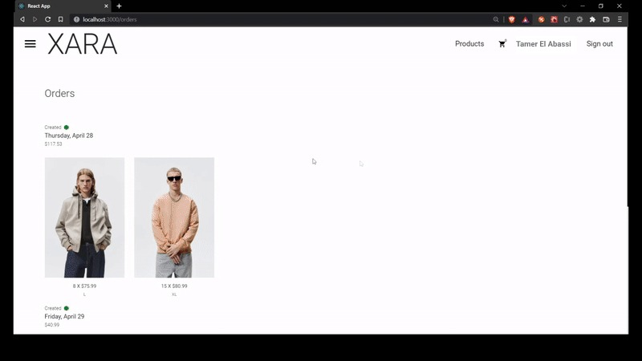

# E-Commerce Platform

A full-stack e-commerce application built with **Spring Boot and React**, featuring categorized products, a shopping cart, and an order processing system. Designed for scalability and maintainability with SOLID principles and OOP best practices.

## ✨ Features

- Categorized product listings with filtering and sorting  
- Product details page with item specifications  
- Shopping cart with preview and checkout functionality  
- Order processing system for purchasing items  
- User authentication and session management  

## 🛠 Tech Stack

- **Frontend:** React, CSS  
- **Backend:** Java, Spring Boot, PostgreSQL, Hibernate, JPA  
- **Testing:** JUnit  

## 📸 Screenshots & Demos

- **Home Feed:**  
    

- **Product Listings:**  
    

- **Product Details Page:**  
    

- **Cart Preview:**  
    

- **Shopping Cart:**  
    

